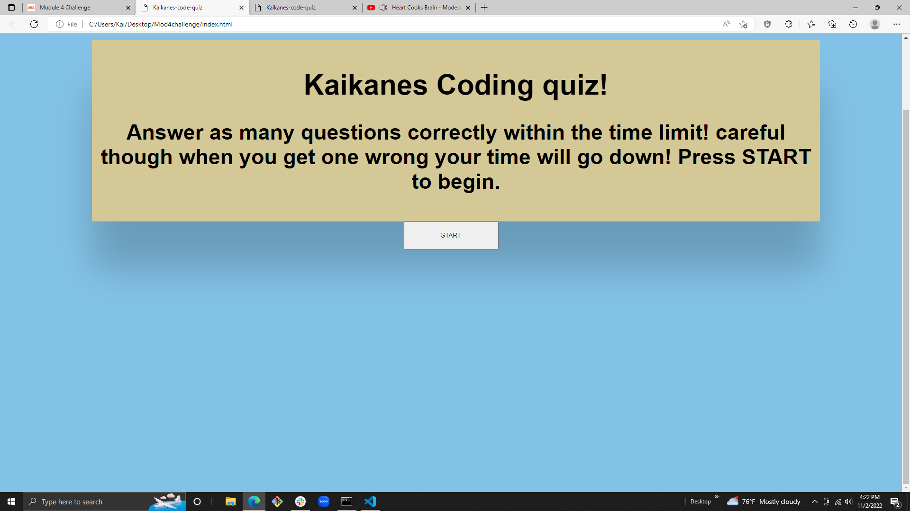

# kaikanes-code-quiz
***
A site that tests the user on JavaScript fundamentals with a code quiz! It also stores highscores and initials of the user. click the start button to begin. you are timed and when you answer a question incorrectly your timer goes down! When all questions are answered or the timer hits 0 the game is over. Save score and initials to show off your highscore!
## Usage
***
To test knowledge and gauge progress compared to others
### Technologys
***
* www.google.com
* www.w3schools.com
* Github.com
* Slack
* Zoom
#### Screen shot
***

##### Link
***
click for deployed app
[click me](https://lacnoskillz.github.io/kaikanes-code-quiz/)